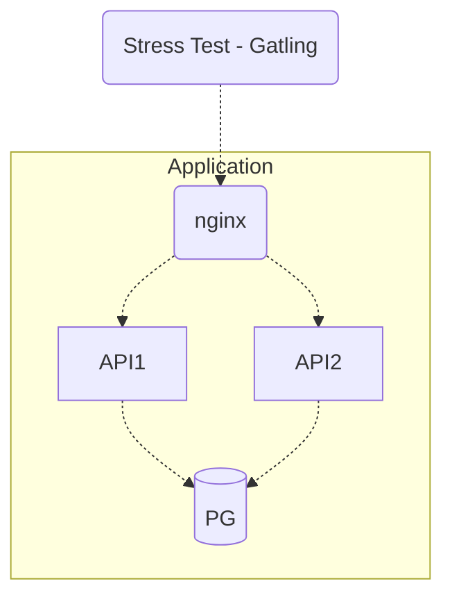

# Rinha de Backend, Segunda Edição: 2024/Q1 - Controle de Concorrência

  
  
  
  
  

## Tecnologies:

**Bun.js** with **Typescript** and **Elysia**

**Nginx** as loadbalancer

**PostgreSQL** database

## General vision :eyes:

## Stress Test

### Considerations :alien:

    Don't consider this project, I'm just testing a few things.
